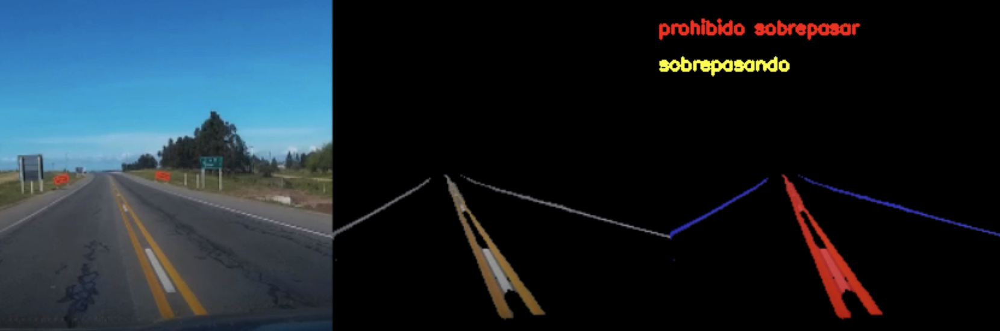

# TICV-UNASEVI

Repositorio del proyecto UNASEV-I  
Federico Abdo, Juan Abu Arab, Maximiliano Palay, Juan Regent  
Laboratorio TIC V  
Universidad de Montevideo  
2020

## Objetivo

Se propone diseñar y poner en funcionamiento un sistema que permita detectar sobrepasos entre vehículos en zonas donde está prohibido sobrepasar.
